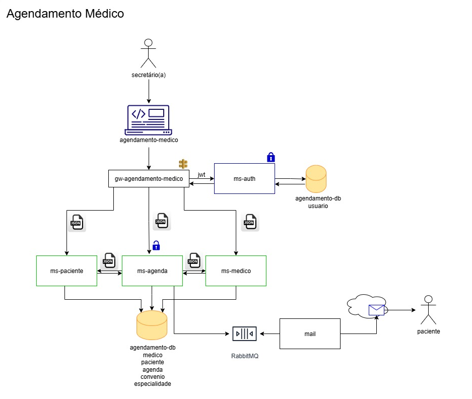

# 🏥 Agendamento Médico

Este projeto é uma aplicação **Full Stack** para gerenciamento de um sistema de **Agendamento de Consultas Médicas**.  
Separado em microsserviços, inclui **API RESTful (Spring Boot)** no backend e uma **interface web** moderna no frontend (HTML, CSS e JS).
Possui serviço gateway e de autenticação e autorização com Spring Security e JWT.



A aplicação permite gerenciar:
- 👨‍⚕️ **Médicos** e suas especialidades
- 🧑‍🤝‍🧑 **Pacientes** e seus convênios
- 🩺 **Especialidades**
- 🏥 **Convênios**
- 📅 **Agendamentos de consultas médicas**
- ✉️ **Envio de e-mail**

---

## 🚀 Funcionalidades

✅ Cadastro, edição, listagem e exclusão de **Médicos, Pacientes, Especialidades e Convênios**  
✅ Agendamento, remarcação e cancelamento de consultas  
✅ Validações de dados com mensagens de erro amigáveis  
✅ Layout com **Glassmorphism** para uma interface moderna e responsiva  
✅ Navegação entre páginas para cada módulo do sistema  
✅ Paginação na listagem de registros  
✅ Máscaras para campos (ex.: telefone) e validação de e-mail  
✅ Backend robusto com **Spring Boot + JPA + Autenticação e Autorização com Spring Security e JWT + Gateway**  
✅ Conexão com banco de dados relacional (Postgre)  
✅ Documentação da API com **Swagger/OpenAPI**

---

## 🌐 Acesso Local

Após iniciar a aplicação (backend rodando), acesse no navegador:

http://localhost:8080/index.html

- Página principal: contém os botões de navegação para os módulos (Agendamentos, Médicos, Pacientes, etc.)
- API Swagger (para testar os endpoints REST):

---

## 🖼️ Interface do Sistema


---

## ⚙️ Tecnologias Utilizadas

### 🔹 Backend
- [Java 17+](https://www.oracle.com/java/)
- [Spring Boot](https://spring.io/projects/spring-boot)
  - Spring Web (REST Controllers)
  - Spring Data JPA (persistência)
  - Validação com `javax.validation` / `jakarta.validation`
- [Hibernate](https://hibernate.org/)
- Banco de dados:
  - **H2** (desenvolvimento)
  - Pode ser facilmente adaptado para MySQL ou PostgreSQL
- [Swagger / OpenAPI 3](https://swagger.io/) (documentação da API)
- Gerenciador de dependências: **Maven**
- Autenticação e Autorização usando Spring Security e JWT
- Mensageria usando RabbitMQ

### 🔹 Frontend
- HTML5, CSS3 e JavaScript puro
- Layout **Glassmorphism** responsivo
- Paginação e interações dinâmicas via `fetch`

---

## 📂 Estrutura do Projeto


```plaintext
AgendamentoMedico/
│
├── src/main/java/com/example/AgendamentoMedico/
│ ├── config/ # Configurações gerais (ex.: CORS)
│ ├── controllers/ # Endpoints REST (Agendas, Médicos, Pacientes, etc.)
│ ├── dtos/ # DTOs de Request e Response
│ ├── enums/ # Enums (StatusAgenda, TipoConsulta, etc.)
│ ├── exceptions/ # Tratamento centralizado de erros
│ ├── mappers/ # Conversão entre entidades e DTOs
│ ├── models/ # Entidades JPA (Paciente, Médico, Agenda, etc.)
│ ├── repositories/ # Interfaces JPA para persistência
│ └── services/ # Lógica de negócio
│
├── src/main/resources/
│ ├── application.properties # Configurações do Spring Boot
│ ├── static/ # Arquivos do frontend
│ │ ├── index.html # Página inicial com menu de navegação
│ │ ├── agenda.html # Tela de agendamentos
│ │ ├── medico.html # Tela de médicos
│ │ ├── paciente.html # Tela de pacientes
│ │ ├── especialidade.html # Tela de especialidades
│ │ ├── convenio.html # Tela de convênios
│ │ ├── css/ # Estilos (Glassmorphism e layouts)
│ │ └── js/ # Lógica de frontend
│
├── pom.xml # Configuração do Maven
└── README.md # Documentação do projeto
```
---

## 📡 Endpoints Principais

| Recurso          | Método  | URL                                          | Descrição                                 |
|------------------|---------|----------------------------------------------|-------------------------------------------|
| **Agendamentos** | GET     | `/api/agendas`                                   | Lista todos os agendamentos              |
|                  | GET     | `/api/agendas/{id}`                              | Busca um agendamento por ID              |
|                  | POST    | `/api/agendas/agendar`                           | Cria um novo agendamento                 |
|                  | PUT     | `/api/agendas/{id}/remarcar`                     | Remarca um agendamento existente         |
|                  | PATCH   | `/api/agendas/{id}/cancelar`                     | Cancela um agendamento                   |
|                  | DELETE  | `/api/agendas/{id}`                          | Remove um agendamento                    |
| **Médicos**      | GET     | `/api/medicos`                               | Lista todos os médicos (com paginação)   |
|                  | GET     | `/api/medicos/{id}`                          | Busca um médico por ID                   |
|                  | GET     | `/api/medicos/especialidade/{especialidade}` | Lista médicos por especialidade          |
|                  | POST    | `/api/medicos`                               | Cadastra um novo médico                  |
|                  | PUT     | `/api/medicos/{id}`                          | Atualiza um médico existente             |
|                  | DELETE  | `/api/medicos/{id}`                          | Remove um médico                          |
| **Pacientes**    | GET     | `/api/pacientes`                             | Lista todos os pacientes                 |
|                  | GET     | `/api/pacientes/{id}`                        | Busca um paciente por ID                 |
|                  | GET     | `/api/pacientes/email/{email}`               | Busca um paciente por email              |
|                  | GET     | `/api/pacientes/search?nome={nome}`          | Busca pacientes por nome                 |
|                  | POST    | `/api/pacientes`                             | Cadastra um novo paciente                |
|                  | PUT     | `/api/pacientes/{id}`                        | Atualiza um paciente existente           |
|                  | PATCH   | `/api/pacientes/{id}`                        | Atualiza parcialmente um paciente        |
|                  | DELETE  | `/api/pacientes/{id}`                        | Remove um paciente                        |
| **Convênios**    | GET     | `/api/convenios`                             | Lista todos os convênios                  |
|                  | GET     | `/api/convenios/{id}`                        | Busca um convênio por ID                  |
|                  | POST    | `/api/convenios`                             | Cadastra um novo convênio                 |
|                  | PUT     | `/api/convenios/{id}`                        | Atualiza um convênio existente            |
|                  | DELETE  | `/api/convenios/{id}`                        | Remove um convênio                         |
| **Especialidades** | GET   | `/api/especialidades`                        | Lista todas as especialidades             |
|                  | GET     | `/api/especialidades/{id}`                   | Busca uma especialidade por ID            |
|                  | POST    | `/api/especialidades`                        | Cadastra uma nova especialidade           |
|                  | PUT     | `/api/especialidades/{id}`                   | Atualiza uma especialidade existente      |
|                  | DELETE  | `/api/especialidades/{id}`                   | Remove uma especialidade                   |

---

## 🖥️ Como Rodar o Projeto

### 🔹 Pré-requisitos
- Java 17+ instalado
- Maven instalado
- (Opcional) Docker, se for usar container
- Docker Desktop

### 🔹 Passos

### 🔹 Perfil de desenvolvimento com carga inicial
Caso precise carregar os dados iniciais fornecidos pelos scripts SQL, execute a aplicação com o perfil `dev` habilitado. Você pode fazer isso adicionando o parâmetro `--spring.profiles.active=dev` ao comando de execução (por exemplo, `mvn spring-boot:run -Dspring-boot.run.arguments=--spring.profiles.active=dev`).

O perfil padrão mantém `spring.sql.init.mode=embedded`, evitando a execução automática dos scripts em bancos de dados persistentes. Já o perfil `dev` reativa a carga inicial e adia a inicialização do JPA para garantir compatibilidade com o banco em memória H2.

1. Clone o repositório:
   ```bash
   git clone https://github.com/seu-usuario/AgendamentoMedico.git

2. Entre na pasta do projeto:
   ```bash
   cd AgendamentoMedico

3. Compile e execute no docker:
   ```bash
    docker-compose up --build
   
4. Acesse a aplicação no navegador:
   ```bash
   http://localhost:8080/index.html

### 🔹 Rodando com Docker

Caso prefira rodar a aplicação em um container Docker:

1. Buildar a imagem:
   ```bash
   docker build -t agendamento-medico .

2. Rodar o container:
   ```bash
   docker run -p 8080:8080 agendamento-medico

3. Acesse a aplicação no navegador:
   ```bash
   http://localhost:8080/index.html

## 🛠️ Estrutura das Branches

- main → branch de produção / releases
- develop → branch principal de desenvolvimento

## 📄 Licença

Este projeto é open-source e pode ser usado para fins educacionais e acadêmicos.

---

## ✍️ Autores:
Desenvolvido por Caio Victor, Josiane Cavalheiro, Marcilio Silva e Valdeci Alcântara 🚀
Com colaboração para layout, validações e estrutura de branches.

